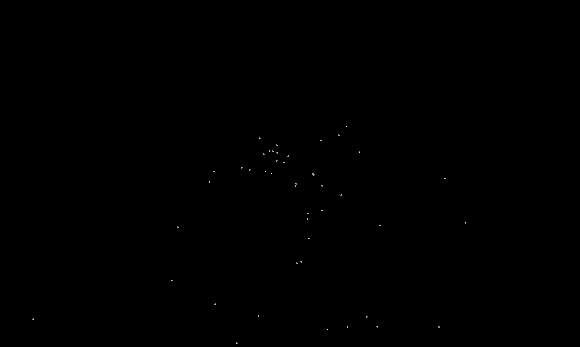
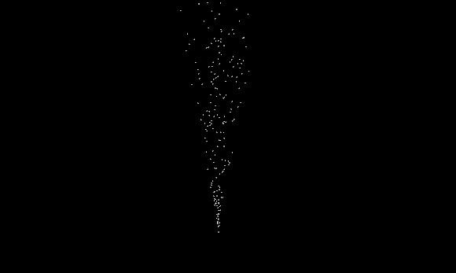
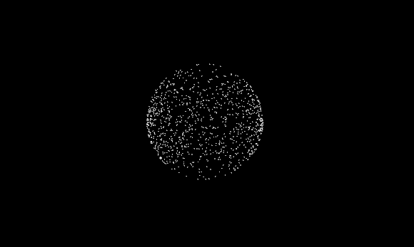

# Kiwi: Seed

* Alexander Chan

## Summary
A particle system tool focusing on authorability and flexibility. Supports the following:
* Custom particle properties
* Modular behavior system
* Object pool for no dynamic memory allocation

## Description

### Overview
A `Kiwi::Seed::SeedSystem` is a component that can be attached to a `GameObject` like any other. It is in fact a behavior component. The system requires emitters to be attached before anything can be simulated/rendered. Multiple emitters can be attached to the same system, and each emitter will act separately.

### Emitters
An emitter contains a variety of modules that describe how its particles behave, a spawner describing how particles are spawned, any number of render modules that describe how the particles are rendered, and a particle manager that stores information about each particle. To reduce the number of dynamic memory allocations required, the particle manager uses an object pool, reusing particles as they die.

The emitter also contains the particle spawn rate, which can be specified as a function of time.

### Particle Manager
The particle manager maintains an pool of particles in addition to keeping track of all particle properties at every tick. By default, the particle manager keeps track of the following properties:

- Position (Vector3)
- Velocity (Vector3)
- Acceleration (Vector3)
- Force (Vector3)
- Mass (float)
- Color (Vector4)
- Lifetime (float)

However, custom properties of any arbitrary type can also be added to the particle manager. For example, if you wanted to keep track of past particle positions to render particle trails, you can add a property of type `std::array<Vector3, 4>`. Then, you could write a custom module that updates this property on every tick.

### Modules
Modules dictate the behavior of all the particles. They can read and write to the properties of each particle managed by the particle manager. The following modules are provided:

- TickLifetimeModule

	When enabled, simply decreases the lifetime of each particle by dt (time since last tick), and kills the particle if its lifetime drops below 0.

- PhysicsModule

	Recomputes the acceleration on each particle, and performs explicit Euler integration to compute the particle's new position and velocity.

- ResetForceModule

	Resets the force on each particle.

- GravityModule

	Adds the force of gravity to each particle (default Vector3(0, -9.8, 0), but can be customized).

Each module is meant to implement a very specific behavior, so that multiple modules can act together to create desired effects.

### Spawners
The spawner determines all the properties a particle will have when it spawns - including any custom properties the user may wish to add. For example, the `FountainSpawner` spawns particles at the emitter's world position and a velocity randomly sampled in a cone specified by the spawner's member variables.

### Renderers
Each emitter can have any number of renderers. This allows the particles to be rendered multiple times for different effects. Provided is an implementation of a point renderer, that simply draws the particles as points with their position and color. Other examples of renderers that can easily be added are instanced sprite and instanced mesh renderers.

### Results
Here are some results of using the tool.

These first two use the fountain spawner.

The next one uses a custom spawner and custom module.

